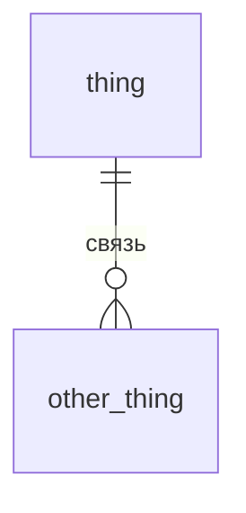

# Семинар 2 · Схема нашего проекта

Задание — [seminar02.pdf](seminar02.pdf). Пример диаграммы из лекции — [example/schema.mmd](example/schema.mmd).

## Команда и предметная область

- Команда: …
- Объект: …

## Сущности (часть 1)

| Сущность | Естественный ключ | Атрибуты | Примечание |
|---|---|---|---|
| … | … | … | … |

## Связи

| A — B | Кардинальность | Обязательна? | Атрибуты связи |
|---|---|---|---|
| … | 1:N | … | … |

## Что меняется во времени

- …

## диаграмма «сущность — связь» (часть 2)

## Миграции (части 3 и 5)

- `migrations/V1__init.sql` — …
- `migrations/V2__….sql` — что исправили по ревью

## Взаимная проверка

Замечания к нам — [review.md](review.md). Проверка, которую сделали мы: ссылка на репозиторий другой команды.
